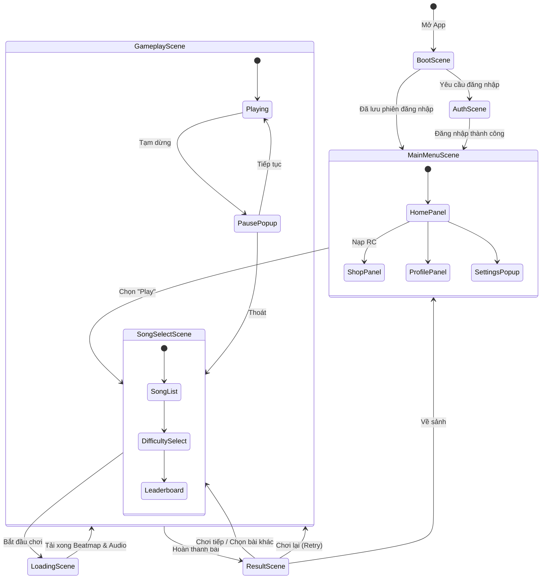
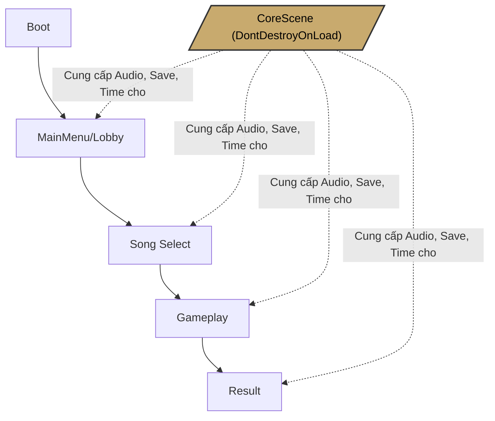

# 🎬 Thiết Kế Cấu Trúc Scene - Project Beat

Dựa trên cấu trúc mã nguồn hiện tại của Project Beat và các tiêu chuẩn phát triển Rhythm Game mobile (như Cytus II, Arcaea), dưới đây là thiết kế sơ đồ các Scene cần thiết và luồng hoạt động của chúng.

## 1. Sơ Đồ Luồng Chuyển Scene (Scene Flow)

Sơ đồ dưới đây thể hiện vòng lặp cốt lõi của người chơi từ lúc mở app đến khi chơi game.

---

## 2. Danh Sách Các Scene Cốt Lõi

### 🚀 1. `BootScene` (Khởi tạo)
- **Chức năng**: Scene đầu tiên được load. Hiển thị logo studio/game.
- **Nhiệm vụ ngầm**: 
  - Khởi tạo các Manager dùng chung (khởi tạo `DontDestroyOnLoad` cho `AudioManager`, `SaveManager`, `CloudSyncManager`).
  - Kiểm tra kết nối mạng (`NetworkMonitor`).
  - Đọc file Save (`SaveManager.LoadData`).
  - Kiểm tra trạng thái đăng nhập (Token/Session).
- **Chuyển tiếp**: Tự động chuyển sang `AuthScene` (nếu chưa login) hoặc `MainMenuScene`.

### 🔐 2. `AuthScene` (Đăng nhập)
- **Chức năng**: Giao diện đăng nhập / đăng ký tài khoản.
- **Thành phần**: Sử dụng `AuthManager` để gọi API tới backend Node.js.
- **Lưu ý**: Có thể tích hợp thẳng vào `BootScene` dưới dạng Panel để bớt 1 lần load scene nếu app nhẹ.

### 🏠 3. `MainMenuScene` (Sảnh chờ / Lobby)
- **Chức năng**: Trung tâm điều hướng của game.
- **Thành phần UI**:
  - Nút Play (Chuyển sang `SongSelectScene`).
  - Cửa hàng (Mở WebView / gọi API nạp Rhythm Coins - RC).
  - Cài đặt (Audio, Visual, Gameplay - sử dụng `UIManager`).
  - Thông tin người chơi (Level, Rank, Accuracy tổng).

### 🎼 4. `SongSelectScene` (Chọn bài hát)
- **Chức năng**: Nơi người chơi lướt danh sách bài hát, chọn độ khó.
- **Thành phần**:
  - `SongListManager`: Render danh sách bài (dạng danh sách hoặc vòng xoay carousel).
  - `SelectedSongManager`: Hiển thị high score, rank hiện tại của bài hát đó.
  - Nút bắt đầu tải game.

### ⏳ 5. `LoadingScene` (Tải dữ liệu)
- **Chức năng**: Màn hình chờ (có thể hiện tips, art background đẹp).
- **Nhiệm vụ ngầm**: Load Async `GameplayScene`, giải phóng (Unload) memory của UI, nạp AudioClip và Beatmap data vào RAM. Rất quan trọng đối với mobile để tránh giật lag lúc mới vào bài.

### 🎮 6. `GameplayScene` (Chơi game)
- **Chức năng**: Nơi diễn ra gameplay chính.
- **Thành phần**: 
  - `NoteManager`, `RhythmTimeManager`, hệ thống Hitline, Lanes.
  - HUD: `ComboDisplay`, `AccuracyUI`.
  - Pause Menu.

### 🏆 7. `ResultScene` (Kết quả)
- **Chức năng**: Hiển thị điểm số, phán xét (Perfect, Great, Miss), Combo, Accuracy và Rank (S, A, B...).
- **Nhiệm vụ ngầm**: Gọi `SaveManager.SaveResult()`, lưu local và đồng bộ lên server. Hiển thị hiệu ứng All Perfect/Full Combo.

---

## 3. Đề Xuất Kiến Trúc Multi-Scene (Additive Loading)

Hiện tại `UIManager.cs` đang quản lý cả Lobby và Gameplay dưới dạng Panel (`lobbyPanel`, `gameplayPanel`). Việc gộp tất cả vào 1 scene (Single Scene) cho Rhythm Game sẽ dẫn đến **nặng RAM, khó quản lý bộ nhớ và khó tách biệt logic**.

Đề xuất sử dụng mô hình **Core + Additive Scenes**:

### Cách thực hiện:
1. Tạo một scene tên là **`CoreScene`**. Trong này chứa các Prefab Singleton: `AudioManager`, `SaveManager`, `CloudSyncManager`, `RhythmTimeManager`.
2. Khi game chạy `BootScene`, nó sẽ load `CoreScene` ở dạng `LoadSceneMode.Additive` và không bao giờ Unload nó.
3. Các scene UI và Gameplay (Lobby, SongSelect, Gameplay) sẽ được load và unload luân phiên. Khi Gameplay chạy, Lobby sẽ bị unload hoàn toàn khỏi RAM, giúp game chạy mượt hơn trên mobile.

> [!TIP]
> **Tối ưu UI**: Trong Rhythm Game, UI của Gameplay (HUD) cần được tách biệt hoàn toàn với UI của Lobby. Việc chia Scene sẽ giúp `UIManager` không bị quá tải bởi hàng chục reference không cần thiết lúc đang chơi game.
